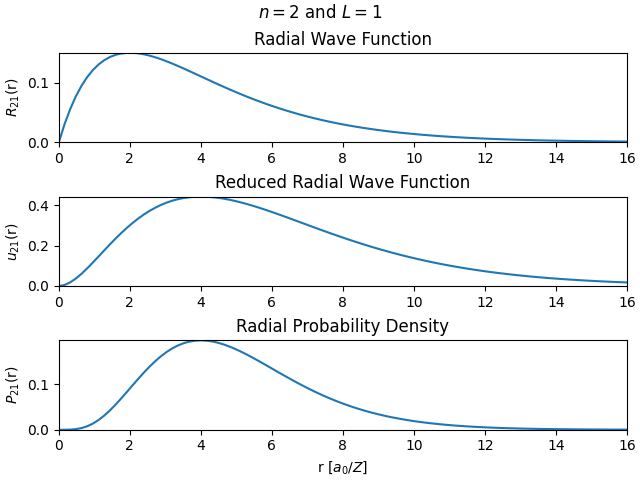

# **Exercise 2**: Plotting of Radial Wave Function

- [Main program](#main-program)
- [Mathematics behind code](#mathematics-behind-code)
   * [Finding the constraints of R (normalization integral)](#finding-the-constraints-of-r-normalization-integral)
   * [Rewriting the sum in the integral](#rewriting-the-sum-in-the-integral)
   * [Evaluating the integral](#evaluating-the-integral)
   * [Solving for b0](#solving-for-b_0)

## Main program
The program `plot.py` calls `calc.py` which uses analytical solutions to determine the Radial Wave Function values for a given set of quantum numbers $n$ and $l$ and atomic number $Z$. The program `plot.py` then plots the Radial Wave Function together with the Reduced Radial Wave Function and the Radial Probability Density; thus visualizing how far away form the nucleus the lone electron most likely will be (note that this is not a valid model for large $Z$). 

_The program also prints out the integral of the Radial Probability Density, as to verify that it is approximately_ $1$. _The higher `rmax` and `prec` values, the closer you get to_ $1$.

Example of how to run the program with quantum numbers $n=2$ and $l=1$, and atomic number $Z=1$. We use `rmax=16` to specify the maximum distance away from the nucleus to calculate for, and `prec=100` amount of points between `0` and `rmax` for the plotting (higher `prec`, smoother plot)

```bash
python plot.py -n 2 -L 1 -Z 1 --rmax 16 --prec 100
```

Output:

```
Integral of Radial Probability Density fom 0 to 16.0 = 0.9995995003362249
```




## Mathematics behind code

_NOTE: GitHub does not have the best renderer for LaTeX. I recommend viewing this in VSCode's Markdown previewer._

We have three functions (all in atomic units) which we want to plot for arbitrary $n$, $l$ and $Z$ values:

The **Radial Probability Density**
```math
    P_{n l}(r) = \left|u_{n l}(r)\right|^2
```

where $u_{n l}(r)$ is the **Reduced Radial Wave Function**

```math
    u_{n l}(r) = r R_{n l}(r)
```

where $R_{n l}(r)$ is the **Radial Wave Function**

```math
    R_{n l}(r) = \frac{Z}{n} e^{-Z r / n} \sum_{k=0} b_k \left(\frac{Z r}{n}\right)^{(k + l)}
```

where $b_k$ is given recursively as

```math
    b_{k + 1} = \frac{2(k + l -n + 1)}{(k + 1)(k + 2l + 2)}b_k
```

where the first $b_k$ value, $b_0$, is found by the normalization condition of the wave function of the electron.

The main part of this program (and this README) focuses on finding $b_0$. To find it, we first need to find the constraints of $R = R_{n l}(r)$ given by the normalization condition.

### Finding the constraints of $R$ (normalization integral)

The Radial Wave Function arises from the assumption that we can write certain wave functions $\psi$ as

```math
    \psi_{n l m}(r, \theta, \phi) = R_{n l}(r) Y_l^m(\theta, \phi)
```

where $Y = Y_l^m(\theta, \phi)$ is the Angular Wave Function. We will not go into detail about this one, other than that the integral of $Y^*Y$ on its domain is equal to $1$.

In quantum mechanics, we have the following constraint for "correct" wave functions

```math
    1 = \int_{\mathbb{R}^3} \psi^*\psi \, d\vec{r}
```

In our case, $\psi$ is expressed in spherical coordinates, so writing this as a triple integral, we get

```math
\begin{align*}
1 &= \int_0^\infty \int_0^\pi \int_0^{2\pi} \psi^*\psi \, r^2 \sin(\theta) d\phi d\theta dr \\
  &= \int_0^\infty \int_0^\pi \int_0^{2\pi} R^* Y^* R Y \, r^2 \sin(\theta) d\phi d\theta dr
\end{align*}
```

Now, since $Y$ depends only on $\theta$ and $\phi$, while $R$ only depends on $r$, we can write this as

```math
1 = \int_0^\infty R^* R \, r^2  dr  \int_0^\pi \int_0^{2\pi} Y^*Y  \sin(\theta) d\phi d\theta
```

and since we already know that the integral of $Y^*Y$ on its domain is equal to $1$, and that $R$ is a purely real function, we end up with

```math
\begin{align*}
1 &= \int_0^\infty r^2 \left|R\right|^2 dr
\end{align*}
```

Which, when more fully expressed, becomes

```math
\begin{align*}
1 &= \int_0^\infty r^2 \left|R\right|^2 dr \\
  &= \int_0^\infty r^2 \left|\frac{Z}{n} e^{-Z r / n} \sum_{k=0} b_k \left(\frac{Z r}{n}\right)^{(k + l)}\right|^2 dr \\
  &= \int_0^\infty r^2 \left(\frac{Z}{n} e^{-Z r / n}\right)^2  \left|\sum_{k=0} b_k \left(\frac{Z r}{n}\right)^{(k + l)}\right|^2 dr \\
  &= \left(\frac{Z}{n}\right)^2 \int_0^\infty r^2 e^{-2Z r / n}  \left|\sum_{k=0} b_k \left(\frac{Z r}{n}\right)^{(k + l)}\right|^2 dr \\
  &= \left(\frac{Z}{n}\right)^2 \int_0^\infty r^2 e^{-2Z r / n}  \left|\sum_{k=0} b_k \left(\frac{Z r}{n}\right)^k \left(\frac{Z r}{n}\right)^l\right|^2 dr \\
  &= \left(\frac{Z}{n}\right)^2 \int_0^\infty r^2 e^{-2Z r / n}  \left(\frac{Z r}{n}\right)^{2l}\left|\sum_{k=0} b_k \left(\frac{Z r}{n}\right)^k\right|^2 dr \\
  &= \left(\frac{Z}{n}\right)^2 \left(\frac{Z}{n}\right)^{2l} \int_0^\infty r^2 e^{-2Z r / n} r^{2l}\left|\sum_{k=0} b_k \left(\frac{Z r}{n}\right)^k\right|^2 dr \\
  &= \left(\frac{Z}{n}\right)^{2 + 2l} \int_0^\infty r^{2 + 2l} e^{-2Z r / n} \left|\sum_{k=0} b_k \left(\frac{Z r}{n}\right)^k\right|^2 dr \\
\end{align*}
```

We now have a better view of the constraint we are beholden to. Now, we need to find out what consequence this has for the value of $b_0$, which is what we are looking for.

### Rewriting the sum in the integral


Let us focus on the sum in the integral:

```math
\sum_{k=0} b_k \left(\frac{Z r}{n}\right)^k
```

Since $b_k$ is given recursively as

```math
    b_{k + 1} = \frac{2(k + l -n + 1)}{(k + 1)(k + 2l + 2)}b_k
```

or equivalently

```math
\begin{align*}
    b_{k} &= b_{k - 1}\frac{2[(k - 1) + l -n + 1]}{[(k - 1) + 1][(k - 1) + 2l + 2]} \\
          &= b_{k - 1}\frac{2(k  + l - n)}{k(k+ 2l + 1)}
\end{align*}
```

we have that all $b_k$'s include the value of $b_0$, so we can actually write the formula as non-recursive given $b_0$ is known:

```math
\begin{align*}
    b_1 &= b_0 \frac{2(1  + l - n)}{1(1+ 2l + 1)} \\
    b_2 &= b_0 \frac{2(1  + l - n)}{1(1+ 2l + 1)} \frac{2(2  + l - n)}{2(2+ 2l + 1)} \\
    b_3 &= b_0 \frac{2(1  + l - n)}{1(1+ 2l + 1)} \frac{2(2  + l - n)}{2(2+ 2l + 1)} \frac{2(3  + l - n)}{3(3+ 2l + 1)} \\
    &\vdots \\
    b_j &= b_0 \prod_{i=1}^{j} \frac{2(i + l - n)}{i(i + 2l + 1)} \\
\end{align*}
```
Thus we have a explicit formula for $b_j$ where $j \geq 1$. We then rewrite the expression as

```math
\begin{align*}
    b_j &= b_0 \frac{\prod_{i=1}^{j} 2(i + l - n)}{\prod_{i=1}^{j} j(i + 2l + 1)} \\
    b_j &= b_0 \frac{\prod_{i=1}^{j} (i + l - n)}{\prod_{i=1}^{j} (i + 2l + 1)} \cdot \frac{\prod_{i=1}^{j}2}{\prod_{i=1}^{j}j} \\
    b_j &= b_0 \frac{\prod_{i=1}^{j} (i + l - n)}{\prod_{i=1}^{j} (i + 2l + 1)} \cdot \frac{2^j}{j!} \\
    b_j &= b_0 \frac{\prod_{i=1}^{j} [(l - n) + i]}{\prod_{i=1}^{j} [(2l + 1) + i]} \cdot \frac{2^j}{j!}
\end{align*}
```


Before we continue to simplify $b_j$, we need to go over a quick definition of the [Pochhammer function / rising factorial](https://en.wikipedia.org/wiki/Falling_and_rising_factorials):

```math
\begin{align*}
    (x)_j&=x(x + 1)(x + 2)\cdots(x + j - 1) \\
           &=\prod_{i=1}^{j}(x + i - 1) \\
\end{align*}
```

which has the following added definitions of $(x)_0=1$, $(0)_0=1$ and $(0)_j=0$.

_NOTE that one usually writes it as_ $x^{(j)}$, _but this notation was chosen as it is used in [hypergeometric series's](https://en.wikipedia.org/wiki/Hypergeometric_function), as well as it being more cleaner._

In our case, we can therefore write

```math
\begin{align*}
    \prod_{i=1}^{j} [(l - n) + i]  &= \prod_{i=1}^{j} [(l - n + 1) + i - 1]  = (l - n + 1)_j \\
    \prod_{i=1}^{j} [(2l + 1) + i] &= \prod_{i=1}^{j} [(2l + 1 + 1) + i - 1] = (2l + 2)_j
\end{align*}
```

Which leads to a simpler expression for $b_j$

```math
    b_j = b_0 \frac{(l - n + 1)_j}{(2l + 2)_j} \cdot \frac{2^j}{j!}
```

We can now rewrite our sum:

```math
\begin{align*}
    \sum_{k=0} b_k \left(\frac{Z r}{n}\right)^k 
    &= b_0 + \sum_{j=1}b_j \left(\frac{Z r}{n}\right)^j \\
    &= b_0 + \sum_{j=1}b_0 \frac{(l - n + 1)_j}{(2l + 2)_j} \cdot \frac{2^j}{j!} \left(\frac{Z r}{n}\right)^j \\
    &= b_0 + b_0\sum_{j=1}\frac{(l - n + 1)_j}{(2l + 2)_j} \cdot \frac{2^j}{j!} \left(\frac{Z r}{n}\right)^j \\
    &= b_0 + b_0\sum_{j=1}\frac{(l - n + 1)_j}{(2l + 2)_j} \cdot \frac{(2 Z r / n)^j}{j!} \\
\end{align*}
```

We have that 

```math
\frac{(l - n + 1)_0}{(2l + 2)_0} \cdot \frac{(2 Z r / n)^0}{0!} = \frac{1}{1}\cdot\frac{1}{1} = 1
```

thus, we can rewrite the new sum as

```math
\begin{align*}
    \sum_{j=1}\frac{(l - n + 1)_j}{(2l + 2)_j} \cdot \frac{(2 Z r / n)^j}{j!}
    &= \sum_{j=0}\frac{(l - n + 1)_j}{(2l + 2)_j} \cdot \frac{(2 Z r / n)^j}{j!} -1 \\
\end{align*}
```

And our new expression for the sum in the integral becomes

```math
\begin{align*}
    \sum_{k=0} b_k \left(\frac{Z r}{n}\right)^k 
    &= b_0 + b_0\left(\sum_{j=0}\frac{(l - n + 1)_j}{(2l + 2)_j} \cdot \frac{(2 Z r / n)^j}{j!} -1\right) \\
    &= b_0 + b_0\sum_{j=0}\frac{(l - n + 1)_j}{(2l + 2)_j} \cdot \frac{(2 Z r / n)^j}{j!} -b_0 \\
    &= b_0\sum_{j=0}\frac{(l - n + 1)_j}{(2l + 2)_j} \cdot \frac{(2 Z r / n)^j}{j!}
\end{align*}
```


Now, here comes the cool part, the sum in the last line above is a [hypergeometric function](https://en.wikipedia.org/wiki/Generalized_hypergeometric_function) of the form


```math
    {}_{1}F_{1}(a; b; z) = \sum_{j=0} \frac{(a)_j}{(b)_j}\cdot\frac{z^j}{j!}
```
 
which is also called [Kummer's function of the first kind](https://en.wikipedia.org/wiki/Confluent_hypergeometric_function). We can thus write

```math
\begin{align*}
    \sum_{k=0} b_k \left(\frac{Z r}{n}\right)^k 
    &= b_0 \space {}_{1}F_{1}(l - n + 1; \space 2l + 2; \space 2 Z r / n) \\
\end{align*}
```


We now replace our sum in the integral with our new expression:

```math
\begin{align*}
  1 &= \left(\frac{Z}{n}\right)^{2 + 2l} \int_0^\infty r^{2 + 2l} e^{-2Z r / n} \left|\sum_{k=0} b_k \left(\frac{Z r}{n}\right)^k\right|^2 dr \\
  &= \left(\frac{Z}{n}\right)^{2 + 2l} \int_0^\infty r^{2 + 2l} e^{-2Z r / n} \left|b_0\space{}_{1}F_{1}(l - n + 1; \space 2l + 2; \space 2 Z r / n)\right|^2 dr \\
  &= \left(\frac{Z}{n}\right)^{2 + 2l} \int_0^\infty r^{2 + 2l} e^{-2Z r / n} b_0^2 \left|{}_{1}F_{1}(l - n + 1; \space 2l + 2; \space 2 Z r / n)\right|^2 dr \\
  &= \left(\frac{Z}{n}\right)^{2 + 2l}b_0^2 \int_0^\infty r^{2 + 2l} e^{-2Z r / n} \left|{}_{1}F_{1}(l - n + 1; \space 2l + 2; \space 2 Z r / n)\right|^2 dr \\
\end{align*}
```

Now, we can start to actually evaluate the integral.

### Evaluating the integral

Since $l \in [0, n-1]$, then we have that the value $l - n + 1$ is always non-positive (i.e. less than or equal to zero). Which means the first parameter of our hypergeometric function is non-positive, which is a good thing! 


The Hypergeometric function we are working with (Krummer's function of first kind) has a nice relationship with (in fact, it's the actual definition of) [Laguerre polynomials](https://en.wikipedia.org/wiki/Laguerre_polynomials#Properties), when the first parameter is non-positive:

```math
    L_a^b(z) = {a + b \choose a}{}_{1}F_{1}(-a;\space b + 1;\space z)
```

where $a$ and $b$ are some non-negative integers. 

In our case, we have $-a = l - n + 1$ and $b + 1 = 2l + 2$, and of course $z = 2 Z r / n$, giving us

```math
\begin{align*}
    L_{n - l - 1}^{2l + 1}(2 Z r / n) &= {n - l - 1 + 2l + 1 \choose n - l - 1}{}_{1}F_{1}(l - n + 1;\space 2l + 2;\space 2 Z r / n) \\
    &= {n + l \choose n - l - 1}{}_{1}F_{1}(l - n + 1;\space 2l + 2;\space 2 Z r / n) \\
    &= \frac{(n + l)!}{(n - l - 1)!(n + l - (n - l - 1))!} {}_{1}F_{1}(l - n + 1;\space 2l + 2;\space 2 Z r / n) \\
    &= \frac{(n + l)!}{(n - l - 1)!(2l +1)!} {}_{1}F_{1}(l - n + 1;\space 2l + 2;\space 2 Z r / n)
\end{align*}
```

Solving for our hypergeometric function, we get

```math
    {}_{1}F_{1}(l - n + 1;\space 2l + 2;\space 2 Z r / n) = \frac{(n - l - 1)!(2l +1)!}{(n + l)!} L_{n - l - 1}^{2l + 1}(2 Z r / n)
```

Putting this into the integral, we get

```math
\begin{align*}
    1 &= \left(\frac{Z}{n}\right)^{2 + 2l}b_0^2 \int_0^\infty r^{2 + 2l} e^{-2Z r / n} \left|\frac{(n - l - 1)!(2l +1)!}{(n + l)!} L_{n - l - 1}^{2l + 1}(2 Z r / n)\right|^2 dr \\
    &= \left(\frac{Z}{n}\right)^{2 + 2l}b_0^2 \left[\frac{(n - l - 1)!(2l +1)!}{(n + l)!} \right]^2 \int_0^\infty r^{2 + 2l} e^{-2Z r / n} \left|L_{n - l - 1}^{2l + 1}(2 Z r / n)\right|^2 dr
\end{align*}
```

Our Laguerre polynomial is real valued, thus we can remove the absolute sign

```math
1 = \left(\frac{Z}{n}\right)^{2 + 2l}b_0^2 \left[\frac{(n - l - 1)!(2l +1)!}{(n + l)!} \right]^2 \int_0^\infty r^{2 + 2l} e^{-2Z r / n} \left[L_{n - l - 1}^{2l + 1}(2 Z r / n)\right]^2 dr
```

Now, the [orthogonality of Laguerre polynomials](https://en.wikipedia.org/wiki/Laguerre_polynomials#Orthogonality) over $[0, \infty)$ make them sometimes nice to integrate. Generally, we have

```math
    \int_0^\infty z^b e^{-z} L_a^b(z)L_c^b(z)\,dz=\frac{\Gamma(a + b + 1)}{a!}\delta_{ac}
```


where $\Gamma$ is the [gamma function](https://en.wikipedia.org/wiki/Gamma_function), and $\delta$ is the [Kronecker-delta](https://no.wikipedia.org/wiki/Kronecker-delta). From this, one should be able to find (though, I was unable to) that:

<!-- My attempt at finding the integral manually

```math
    \int_0^\infty z^b e^{-z} L_a^b(z)L_a^b(z)\,dx = \int_0^\infty z^b e^{-z} [L_a^b(z)]^2\,dz =\frac{\Gamma(a + b + 1)}{a!}
```

In our case, we would have $a = n - l - 1$ and $b= 2l + 1$, and of course $z = 2 Z r / n$, thus

```math
\begin{align*}
    \int_0^\infty \left(2\frac{Zr}{n}\right)^{2l + 1} e^{-2 Z r / n} [L_{n - l - 1}^{2l + 1}(2 Z r / n)]^2\,\frac{2Z}{n}dr &= \frac{\Gamma([n - l - 1] + [2l + 1] + 1)}{(n - l - 1)!} \\
    \int_0^\infty \left(\frac{2Z}{n}\right)^{2 + 2l}r^{1 + 2l} e^{-2 Z r / n} [L_{n - l - 1}^{2l + 1}(2 Z r / n)]^2\,dr &= \frac{\Gamma(n +l + 1)}{(n - l - 1)!} \\
    \left(\frac{2Z}{n}\right)^{2 + 2l}\int_0^\infty r^{1 + 2l} e^{-2 Z r / n} [L_{n - l - 1}^{2l + 1}(2 Z r / n)]^2\,dr &= \frac{\Gamma(n +l + 1)}{(n - l - 1)!} \\
\end{align*}
```
-->

```math
    \int_0^\infty z^{b+ 1} e^{-z} [L_a^b(z)]^2\,dz = \frac{(a + b)!}{a!}(2a + b + 1)
```

In our case, we would have $a = n - l - 1$ and $b= 2l + 1$, and of course $z = 2 Z r / n$, thus

```math
\begin{align*}
    \int_0^\infty \left(2\frac{Z r}{n}\right)^{2 + 2l} e^{-2 Z r / n} [L_{n - l - 1}^{2l + 1}(2 Z r / n)]^2\,\frac{2 Z}{n} dr &= \frac{(n - l - 1 + 2l + 1)!}{(n - l - 1)!}(2[n - l - 1] + 2l + 1 + 1) \\

    \int_0^\infty \left(2\frac{Z}{n}\right)^{3 + 2l} r^{2 + 2l} e^{-2 Z r / n} [L_{n - l - 1}^{2l + 1}(2 Z r / n)]^2\, dr &= \frac{(n + l)!}{(n - l - 1)!}2n \\

    \left(2\frac{Z}{n}\right)^{3 + 2l} \int_0^\infty  r^{2 + 2l} e^{-2 Z r / n} [L_{n - l - 1}^{2l + 1}(2 Z r / n)]^2\, dr &= \frac{(n + l)!}{(n - l - 1)!}2n \\

    \int_0^\infty  r^{2 + 2l} e^{-2 Z r / n} [L_{n - l - 1}^{2l + 1}(2 Z r / n)]^2\, dr &= \left(2\frac{Z}{n}\right)^{-3 - 2l}  \frac{(n + l)!}{(n - l - 1)!}2n \\
\end{align*}
```

which is our integral! We thus end up with

```math
\begin{align*}
1 &= \left(\frac{Z}{n}\right)^{2 + 2l}b_0^2 \left[\frac{(n - l - 1)!(2l +1)!}{(n + l)!} \right]^2 \int_0^\infty r^{2 + 2l} e^{-2Z r / n} \left[L_{n - l - 1}^{2l + 1}(2 Z r / n)\right]^2 dr \\
1 &= \left(\frac{Z}{n}\right)^{2 + 2l}b_0^2 \left[\frac{(n - l - 1)!(2l +1)!}{(n + l)!} \right]^2 \left(2\frac{Z}{n}\right)^{-3 - 2l}  \frac{(n + l)!}{(n - l - 1)!}2n \\
 1 &= 2^{-2-2l}\left(\frac{Z}{n}\right)^{-1}b_0^2 \frac{n(n - l - 1)![(2l +1)!]^2}{(n + l)!} 
\end{align*}
```


### Solving for $b_0$

Now, finally, we solve for $b_0$

```math
\begin{align*}
    b_0^2 &= 2^{2+2l} \frac{Z}{n} \cdot \frac{(n + l)!}{n(n - l - 1)![(2l +1)!]^2} \\
    b_0^2 &= 2^{2+2l} \frac{1}{[(2l +1)!]^2n^2} \cdot \frac{Z(n + l)!}{(n - l - 1)!} \\
    b_0 &= 2^{1+l} \frac{1}{n(2l +1)!} \sqrt{\frac{Z(n + l)!}{(n - l - 1)!}} \\
\end{align*}
```